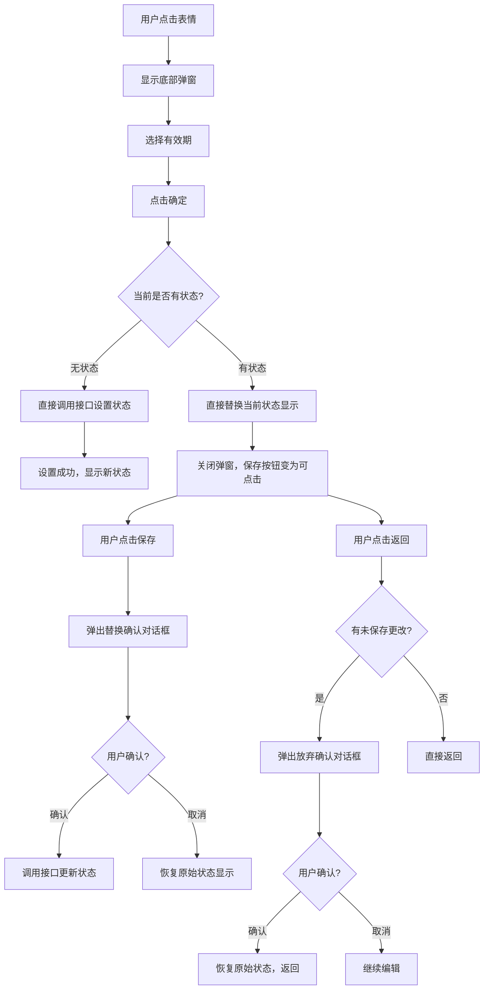

# 状态设置交互流程优化说明

## 📅 更新时间
2025-01-07

## 🎯 优化目标

根据用户需求，重新设计状态设置的交互流程，提供更直观和合理的用户体验。

**最新优化要求：**
1. 不添加新UI，直接替换当前状态显示
2. 保存按钮根据是否有变化控制可点击状态
3. 有效期设置也是先预览，点击保存时才调接口

## 🔄 新的交互流程

### 1. 无状态时的交互流程
**场景：** 用户当前没有设置任何状态

**流程：**
1. 用户点击表情 → 显示底部弹窗
2. 用户选择有效期 → 点击"确定"
3. **直接调用接口设置状态** ✅
4. 设置成功后关闭弹窗，显示新状态

**特点：** 无需二次确认，直接生效

---

### 2. 有状态时的交互流程
**场景：** 用户当前已有状态

**流程：**
1. 用户点击表情 → 显示底部弹窗
2. 用户选择有效期 → 点击"确定"
3. **不调用接口，直接替换当前状态显示** ✅
4. 关闭底部弹窗，保存按钮变为可点击状态
5. 用户点击"保存"按钮 → 弹出确认对话框
6. 用户确认替换 → 调用接口更新状态

**特点：** 直接替换显示，先预览后确认，避免误操作

---

### 3. 返回时的确认流程
**场景：** 用户已选择新状态但未保存时点击返回

**流程：**
1. 用户点击返回按钮
2. **检测到有未保存的更改** ✅
3. 弹出确认对话框："确定要放弃当前更改吗？"
4. 用户选择：
   - **确认** → 清空临时状态，返回上一页
   - **取消** → 继续停留在当前页面

**特点：** 防止用户误操作丢失更改

---

## 🛠️ 技术实现

### 新增状态变量

```dart
/// 临时选中的表情（用于有状态时的临时选择）
final tempSelectedEmoji = Rx<EmojiItem?>(null);

/// 是否有临时状态（已选择新表情但未保存）
final hasTempStatus = false.obs;

/// 临时选中的有效期（用于有状态时的临时选择）
final tempSelectedExpireHours = Rx<int?>(null);

/// 原始状态（用于取消时恢复）
final originalStatusEmoji = Rx<String?>(null);
final originalStatusText = Rx<String?>(null);
```

### 核心方法修改

#### 1. `confirmSetStatus()` - 底部弹窗确定按钮
```dart
void confirmSetStatus() {
  if (selectedEmoji.value == null) return;
  
  // 如果当前没有状态，直接调用接口设置状态
  if (!hasStatus.value) {
    selectedExpireHours.value = tempExpireHours.value;
    _doSetStatus();
  } else {
    // 有状态时，直接替换当前状态显示，但不调用接口
    // 如果是第一次设置临时状态，保存原始状态
    if (!hasTempStatus.value) {
      originalStatusEmoji.value = currentStatusEmoji.value;
      originalStatusText.value = currentStatusText.value;
    }
    
    currentStatusEmoji.value = selectedEmoji.value!.emoji;
    currentStatusText.value = selectedEmoji.value!.name;
    tempSelectedEmoji.value = selectedEmoji.value;
    tempSelectedExpireHours.value = tempExpireHours.value;
    hasTempStatus.value = true;
    // 关闭底部弹窗
    selectedEmoji.value = null;
  }
}
```

#### 2. `saveStatus()` - 保存按钮
```dart
void saveStatus() {
  // 如果有临时状态，需要确认是否替换
  if (hasTempStatus.value && tempSelectedEmoji.value != null) {
    _showReplaceConfirmDialog();
  } else {
    // 没有临时状态，直接返回
    Get.back();
  }
}
```

#### 3. `handleBack()` - 返回按钮
```dart
void handleBack() {
  if (hasUnsavedChanges) {
    _showBackConfirmDialog();
  } else {
    Get.back();
  }
}
```

### UI 更新

#### 1. 直接替换状态显示
- 不添加新的UI元素
- 直接替换当前状态的表情和文字显示
- 保存原始状态用于取消时恢复

#### 2. 保存按钮状态控制
- **无变化时：** 背景色 `#FFB9C8`，不可点击
- **有变化时：** 背景色 `#FF7C98`，可点击
- 根据 `hasUnsavedChanges` 动态控制

#### 3. 返回确认弹窗
添加了返回时的二次确认机制：
- 检测未保存的更改
- 显示确认对话框
- 提供放弃或继续编辑的选项

---

## 📋 交互流程图



---

## ✅ 功能验证

### 1. 无状态流程测试
- ✅ 点击表情显示底部弹窗
- ✅ 选择有效期后点击确定直接设置状态
- ✅ 设置成功后显示新状态
- ✅ 无二次确认弹窗

### 2. 有状态流程测试
- ✅ 点击表情显示底部弹窗
- ✅ 选择有效期后点击确定不调用接口
- ✅ 直接替换当前状态显示
- ✅ 保存按钮变为可点击状态
- ✅ 点击保存时弹出替换确认对话框
- ✅ 确认后调用接口更新状态

### 3. 返回确认流程测试
- ✅ 有临时状态时点击返回弹出确认对话框
- ✅ 确认放弃时恢复原始状态并返回
- ✅ 取消时继续停留在当前页面
- ✅ 无临时状态时直接返回

---

## 🎨 UI 改进

### 保存按钮状态控制
- **无变化时：** 背景色 `#FFB9C8`，文字半透明，不可点击
- **有变化时：** 背景色 `#FF7C98`，文字正常，可点击
- **作用：** 清晰指示用户当前是否有未保存的更改

### 确认对话框
- **替换确认：** "是否要替换之前的状态？"
- **返回确认：** "确定要放弃当前更改吗？"
- **按钮：** 确认/取消，操作明确

---

## 📁 修改文件

### 1. `lib/pages/location/location_state_controller.dart`
- 添加临时状态管理变量
- 重构 `confirmSetStatus()` 方法
- 更新 `saveStatus()` 方法
- 添加 `handleBack()` 方法
- 添加返回确认相关方法

### 2. `lib/pages/location/location_state_page.dart`
- 更新返回按钮点击事件
- 添加临时状态显示UI
- 添加返回确认弹窗方法
- 设置弹窗回调函数

---

## 🎯 优化效果

### 用户体验提升
1. **减少误操作：** 有状态时先预览再确认
2. **操作更直观：** 无状态时直接生效
3. **防止数据丢失：** 返回时二次确认
4. **视觉反馈清晰：** 保存按钮状态明确指示
5. **界面简洁：** 不添加额外UI，直接替换显示

### 交互逻辑优化
1. **流程更合理：** 根据当前状态采用不同策略
2. **确认机制完善：** 关键操作都有确认步骤
3. **状态管理清晰：** 临时状态和正式状态分离
4. **错误处理完善：** 各种异常情况都有对应处理

---

**修改完成时间：** 2025-01-07  
**涉及文件：** 2 个代码文件  
**新增功能：** 临时状态管理、返回确认、保存按钮状态控制、直接替换显示

## 🔄 最新优化内容

### 1. 移除临时状态UI
- ❌ 不再显示额外的"新状态"预览区域
- ✅ 直接替换当前状态的表情和文字显示
- ✅ 保存原始状态用于取消时恢复

### 2. 保存按钮状态控制
- **无变化时：** 背景色 `#FFB9C8`，不可点击
- **有变化时：** 背景色 `#FF7C98`，可点击
- 根据 `hasUnsavedChanges` 动态控制按钮状态

### 3. 有效期设置流程优化
- 有效期选择也是先预览，点击保存时才调用接口
- 临时保存有效期到 `tempSelectedExpireHours`
- 确认替换时使用临时保存的有效期

## 🔧 最新修复内容 (2025-01-07)

### 1. 修复顶部有效期和表情弹窗有效期的关联问题
- ✅ 新增 `topExpireHours` 变量，独立管理顶部有效期选择
- ✅ 表情弹窗使用 `tempExpireHours`，与顶部有效期完全独立
- ✅ 选择表情时使用顶部有效期作为初始值

### 2. 修复顶部有效期切换时的行为
- ✅ 顶部有效期切换时不再调用接口更新状态
- ✅ 只更新 `topExpireHours` 变量，激活保存按钮
- ✅ 点击保存按钮时才调用接口更新有效期

### 3. 修复保存按钮弹窗取消时的行为
- ✅ 取消替换确认弹窗时不再还原状态显示
- ✅ 保持当前临时状态，用户可以继续编辑
- ✅ 只有点击返回按钮时才会恢复原始状态

## 🔧 最新修复内容 (2025-01-07 第二次)

### 1. 去掉_updateExpireTime接口，统一使用设置状态接口
- ✅ 移除独立的`_updateExpireTime`方法
- ✅ 新增`_setStatusWithExpireOnly`方法，使用设置状态接口更新有效期
- ✅ 统一接口调用，简化代码逻辑

### 2. 修复底部弹窗有效期初始状态
- ✅ 底部弹窗有效期固定初始为1小时，不再跟随顶部有效期
- ✅ 顶部有效期和底部弹窗有效期完全独立
- ✅ 选择表情时`tempExpireHours`固定为1小时

### 3. 修复取消保存确认弹窗后保存按钮状态
- ✅ 取消替换确认弹窗后，保存按钮仍然保持可点击状态
- ✅ 不清空临时状态，用户可以继续编辑或重新保存
- ✅ 只关闭底部弹窗，保持编辑状态
